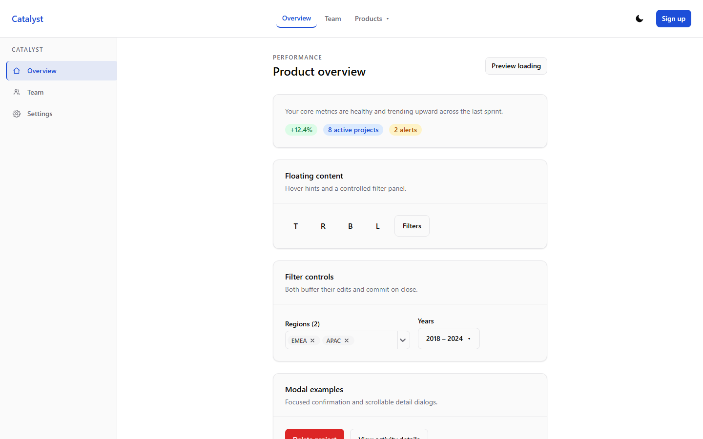

# Catalyst UI

[](https://github.com/nafuza1299/catalyst-ui/actions/workflows/ci.yml)

> Portfolio project by [nafuza1299](https://github.com/nafuza1299). Live: [catalyst-ui.vercel.app](https://catalyst-ui.vercel.app/) · Storybook: [/storybook](https://catalyst-ui.vercel.app/storybook) · Source: [github.com/nafuza1299/catalyst-ui](https://github.com/nafuza1299/catalyst-ui) · [MIT License](LICENSE).

[](https://catalyst-ui.vercel.app/)

A 14-component React library built so that an AI can extend it without inventing
colors. Every component ships a `.spec.md` prop contract next to its source, every
color resolves through a semantic token, and `DESIGN_SYSTEM.md` is a single file you
can hand to a model as the whole context. Two of my other projects run on it.

**Stack:** Vite 6 + React 19 + TypeScript 5.7, Tailwind v4 (`@theme`, no config file), Floating UI, react-select, Jest + Testing Library, Playwright + axe, Storybook 9.

## Running it

```bash
npm install
npm run dev              # showcase app (src/App.tsx)
npm run storybook        # component explorer on :6006
npm test                 # jest, no coverage — the inner loop
npm run test:coverage    # jest + the 80% gate; what CI runs
npm run test:e2e         # playwright, incl. axe in both themes
npm run build            # typecheck + production build
npm run build:storybook  # static Storybook into dist/storybook
```

## What this actually demonstrates

Component libraries are common in portfolios, and a button with four variants is not
the interesting part. What is:

- **One data attribute is the entire theming mechanism.** `[data-theme="dark"]` on
  `<html>` plus a `@custom-variant` — no class swapping, no CSS-in-JS, no theme prop
  on any component. Three separate consumers honour that same contract without
  knowing about each other: the app (`src/theme/ThemeProvider.tsx`), Storybook's
  toolbar (`.storybook/preview.ts`, which sets the attribute *instead of* mounting
  the provider, so the two don't fight over it), and the e2e suite (which seeds
  `localStorage` directly). Break the mechanism and all three fail together.

- **The tokens are the API, and the components may not bypass them.**
  `src/styles/tokens.css` is the only place a color is written down. Categorical tag
  colors are a deliberately separate family from action colors, so nobody reaches for
  "the red one" when they mean destructive.

- **`--color-primary-fg` earns its existence in dark mode.** A blue bright enough to
  read as text on `#0a0a0a` is too bright to carry white text as a button fill — no
  single value satisfies both, which is why the foreground is its own token and flips
  to near-black in dark mode. The axe run in `e2e/a11y.spec.ts` is what forced the
  issue; it now asserts zero WCAG A/AA violations in light, dark, and loading states.

- **Two filter controls that buffer instead of thrashing the parent.** `MultiSelect`
  and `YearRangePicker` commit on close, not on click, so a parent bound to `onChange`
  refetches once per menu session rather than once per keystroke — with `min`/`max`
  enforced against the *in-progress* selection rather than the committed one
  (`src/components/MultiSelect/MultiSelect.tsx`).

- **Static Tailwind class maps in `src/components/Grid/Col.tsx`,** because Tailwind
  cannot see a class name built by string interpolation. The comment in the file is
  the whole explanation, and it is the kind of thing that silently ships broken.

- **One `loading` prop threaded through seven components.** A single toggle in
  `App.tsx` drops MenuBar, SideNav, Card, Tag, Tooltip, Popover and Modal into
  layout-matched skeletons at once — and `e2e/showcase.spec.ts` asserts that
  *composed* state, which per-component jsdom tests can only ever see in isolation.

- **Focus traps written by hand, verified in a real browser.** `Modal`, `SideNav` and
  `MenuBar` each re-query their focusables on every Tab rather than caching a list
  that goes stale. Scroll lock, Escape handling and focus restoration are asserted in
  Playwright because jsdom cannot see any of them.

## Who uses it

Two real consumers, neither via npm:

- **[analytical-dashboard](../analytical-dashboard)** vendors the whole library into
  `src/catalyst-ui/` and excludes it from its own coverage config, treating it as
  third-party code.
- **[split-bill-app](../split-bill-app)** copied only `Button`, `Card`, `Tag` and
  `Tooltip` — and had to strip every `loading` prop from three of them, because
  `Skeleton` was never copied across. Its `Card` and `Tag` have since drifted from
  this repo's.

That second case is the argument for publishing this properly. The reason it isn't
published yet is in Known trade-offs below, not hidden.

## Build order

The commit history is the record: `Button` and the token layer first — nothing else
starts until the tokens settle, because every later component is downstream of them.
Then `Card`, `SideNav`, `MenuBar`, `Tag`, `Modal`, and the Floating UI pair
(`Tooltip`/`Popover`). `Skeleton` came next and was retrofitted across everything
already built, which is why `loading` looks bolted on in the older components and
native in the newer ones. Then `Grid`, then `Layout` (last of the structural pieces,
since it only arranges things that already existed), then the three filter controls.

## Known trade-offs

- **Not an npm package.** There is no library build, no `exports` map, no versioning —
  consumers copy directories. The split-bill-app drift above is the cost, and it is a
  deliberate one for a portfolio repo rather than an oversight.
- **No barrel `index.ts`,** so every import is a deep relative path. That is precisely
  what makes directory-copy vendoring work: a barrel would let a partial copy compile
  and then fail at runtime.
- **`ThemeProvider` reads `localStorage` and `matchMedia` unguarded at init.** Fine in
  a browser; any test or SSR host has to stub `matchMedia` first, since jsdom does not
  ship it. See the stub at the top of `ThemeToggle.test.tsx`.
- **Closed mobile drawers stay mounted** in `SideNav` and `MenuBar`, with a focusable
  close button under `aria-hidden`. At desktop widths they are `display:none` so axe
  is clean, but they would need `inert` before a mobile a11y audit passes — which is
  why `e2e/a11y.spec.ts` documents the 1024px floor instead of quietly testing at one
  width.
- **`YearRangePicker`'s panel does not flip.** It is portalled to `<body>` so an
  `overflow-hidden` ancestor cannot clip it, but it is anchored below the trigger and
  will run past the fold near the bottom of a tall page.

## Adding a component

Four files in `src/components/ComponentName/`, then a row in `DESIGN_SYSTEM.md`:

1. `ComponentName.tsx` — implementation, semantic tokens only
2. `ComponentName.spec.md` — prop contract, same template as `Button/Button.spec.md`
3. `ComponentName.test.tsx` — Jest + Testing Library
4. `ComponentName.stories.tsx` — CSF3, one export per meaningful variant

Add a case to `e2e/showcase.spec.ts` only if the component has behaviour jsdom cannot
see. `CLAUDE.md` carries the invariants and the testing gotchas.
